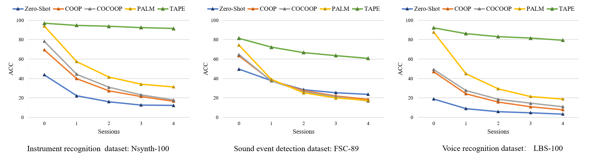
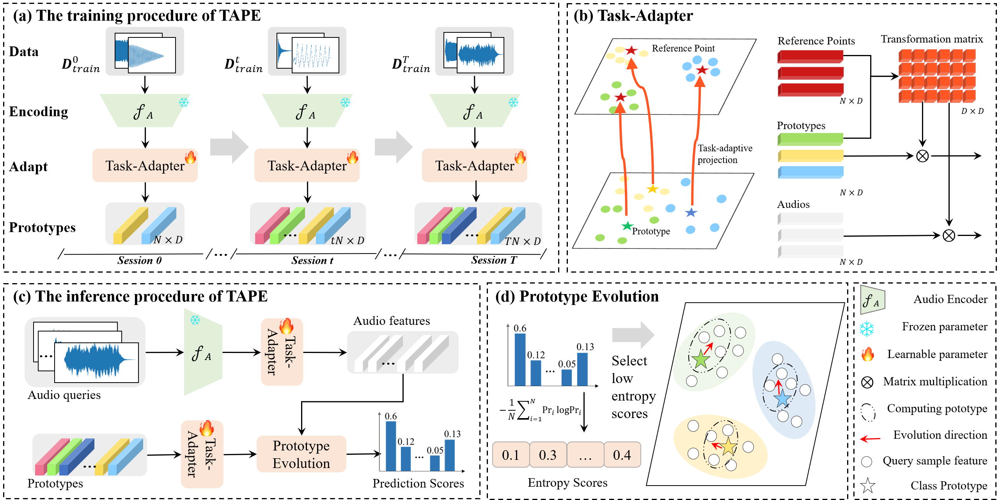

# TAPE: Task-Adaptive Prototype Evolution in Audio-Language Models for Fully Few-shot Class-incremental Audio Classification

## Absract
Fully Few-shot Class-incremental Audio Classification (FFCAC) is challenging since the training samples are limited both in the incremental sessions and in the base session. 
Existing few-shot learning methods suffer from catastrophic forgetting and overfitting when applied to FFCAC.
Pre-trained Audio-Language Models (ALMs) have achieved success in many audio learning tasks. 
However, we find that it is impractical to directly use ALM on FFCAC, since misalignment between text and audio causes even severe catastrophic forgetting and overfitting. We propose a Task-Adaptive Prototype Evolution (TAPE) framework to facilitate ALMs to tackle the challenges of FFCAC, which consists of two key components:
(1) A Task-Adapter that isolates audio features in a metric space to mitigate catastrophic forgetting while preserving knowledge across sessions, 
and (2) A Prototype Evolution mechanism that dynamically refines class prototypes using query samples during inference, thereby enabling adaptive learning and reducing overfitting.
To the best of our knowledge, we are the first to use ALMs on the FFCAC task. 
We conduct experiments on three audio datasets: Nsynth-100 (instrument recognition), FSC-89 (event detection), and LBS-100 (voice recognition). 
The experimental results show that our proposed approach TAPE significantly surpasses the baselines. Specifically, it averagely improves upon the second best from 54.93\%  to 82.76\% in terms of Average Accuracy (AA $\uparrow$), and from 28.74\% to 12.56\% in terms of Performance Dropping rate (PD $\downarrow$).


## Problem



## Method



## Installation

### Datasets
Experiments are carried out on three audio datasets: [Nsynth-100](https://www.modelscope.cn/datasets/pp199124903/LS-100/summary) (instrument recognition), [FSC-89](https://www.modelscope.cn/datasets/pp199124903/Nsynth-100/summary) (event detection), and [LBS-100](https://www.modelscope.cn/datasets/pp199124903/FSC-89/summary) (voice recognition). They are publicly available and are widely used in prior works. 

 

### Pre-trained Models
We have shown the efficacy of TAPE and other baselines (ZERO-SHOT, COOP, COCOOP, PALM) using [PENGI](https://github.com/microsoft/Pengi) model. 

Download the pre-trained PENGI model using the link provided below and place the checkpoint file at path [`pengi/configs`](/pengi/configs) (after clonning the repo). 


| Model | Link | Size |
|:-- |:-- | :-- |
| PENGI | [Download](https://zenodo.org/records/8387083/files/base.pth) | 2.2 GB | 

<br>

PENGI checkpoint can also be downloaded with following command:
```bash
wget https://zenodo.org/records/8387083/files/base.pth
```

</br>


### create ENV


Create a conda environment and install dependencies:
```
git clone https://github.com/YvoGao/TAPE
cd TAPE


conda create -n TAPE python=3.7
source activate TAPE
pip install -r requirements.txt
```


## Quick Start


Noting: before you start, you should download bert-base-uncased from https://huggingface.co/google-bert/bert-base-uncased, and change the path in the ./pengi/configs/base.yml file to your own file path. and you can download the pengi cheakpoint by wget `https://zenodo.org/records/8387083/files/base.pth` put at the path ./pengi/configs/

The specific parameters per dataset in the paper are consistent with run.sh.
```
sh run.sh
```

## Acknowledgements
This repo is build upon previous amazing repos include [PENGI](https://github.com/microsoft/Pengi) and [PALM](https://github.com/asif-hanif/PALM). Thanks for their contributions to the field.


## Citation

```
@inproceedings{Gao_2026_CVPR,
  title        = {TAPE: Task-Adaptive Prototype Evolution in Audio-Language Models for Fully Few-shot Class-incremental Audio Classification},
  author       = {Gao, Yunlong and Liang, Wenxin and Wang, Guanglu and Guan, Senqi and Zong, Linlin and Zhang, Dongyu and Liu, Xinyue},
  booktitle    = {Proceedings of the IEEE/CVF Conference on Computer Vision and Pattern Recognition (CVPR)},
  month        = jun,
  year         = {2026},
}
```


